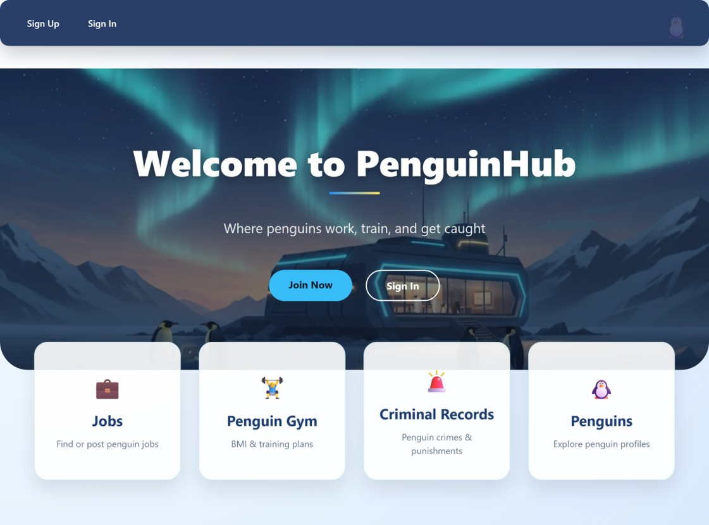
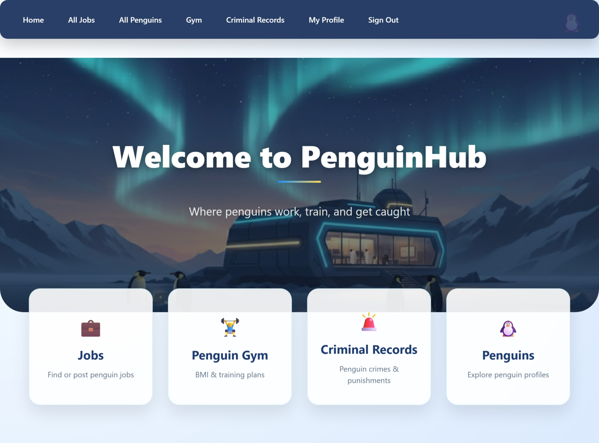
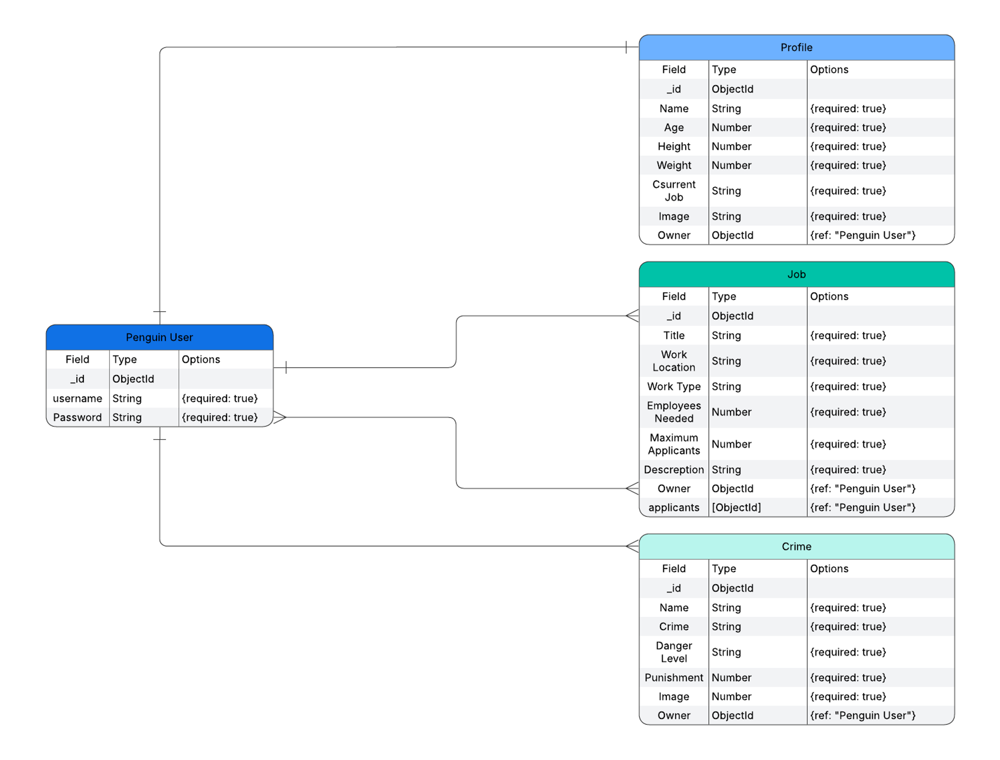

# 🐧 Penguin Hub

## Planing App  

## ERD

## App Name
**Penguin Career Hub**

**Description:**  
A fun full-stack web application where penguins can create profiles, showcase their skills, and apply for jobs in a whimsical penguin world. Users can view penguin profiles, track their experience, and browse or apply to job listings.

**Why I built it:**  
I wanted to create a playful and humorous app that demonstrates full CRUD functionality while allowing me to practice user authentication, relational database management, and dynamic content rendering.

## Getting Started

**How to Run Locally:**  
1. Clone the repo: `git clone [AUTH]`  
2. Install dependencies: `npm install`  
3. Run the server: `npm start`  
4. Open in browser at `http://localhost:3000`

## Technologies Used
- **Frontend:** HTML, CSS, JavaScript, EJS  
- **Backend:** Node.js, Express.js  
- **Database:** MongoDB with Mongoose  
- **Other Libraries:** Method-override, bcrypt (if using authentication), dotenv

## Next Steps / Stretch Goals
- Add Gym feature: Personalized workout plans for penguins based on weight and height  
- Add Crime Records: Log penguin “criminal” behavior in the colony  
- Add profile pictures upload  
- Add achievements / badges for penguins  
- Add notifications when a job application status changes
